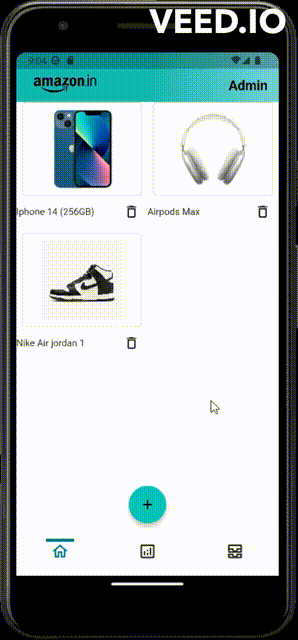

#  - Flutter app (AMAZON CLONE) -

This app was created by Yosri Zaghouani .

Please note that this app is for educational purposes and doesn't replace the official Amazon app. It's meant to showcase the capabilities of Flutter and to provide a fun and interactive way to explore product browsing and searching concepts.

  

       

## About

Welcome to the Flutter Amazon Clone app! This app provides you with a seamless shopping experience, allowing you to browse, search, and purchase products just like you would on Amazon's platform.

You can download the Flutter Amazon Clone app and follow the instructions to install it on your device. Alternatively, you can directly access and use the app on your device.

This app is built using Flutter, a powerful open-source framework for creating natively compiled applications for mobile, web, and desktop from a single codebase.

## Features

The Flutter Amazon Clone app offers a range of features to enhance your shopping experience:

Browse and search for a wide variety of products, just like on Amazon's platform.
Access your Amazon account to view your orders, wishlists, and more.
View detailed product information, including images, descriptions, prices, and customer reviews.
Add products to your cart and proceed to checkout for a smooth purchasing process.
Utilize a user-friendly and intuitive interface for easy navigation.
Explore a range of categories to find the products you're interested in.
Enjoy a responsive design that adapts to different screen sizes and orientations.
Secure and private usage, with no data collected or shared.
The Flutter Amazon Clone app is a learning project and a demonstration of Flutter's capabilities. It is not affiliated with Amazon and does not provide real purchasing functionality.

## Screenshots

  

    
## Permissions

The Flutter Amazon Clone app respects your privacy and requires the following permissions on Android versions prior to Android 6.0:

Full Network Access: This permission is essential for accessing the internet to retrieve product information, images, and reviews.
View Network Connections: The app uses this permission to check your device's network connection status before making requests.
Run at Startup: If you choose to enable the Auto-Sync feature, this permission is used to ensure the app runs in the background when your device starts up.
Read and Write Access to External Storage: The app uses this permission to cache product images for offline viewing, providing a seamless experience even without an active internet connection.
Please note that your privacy and data security are of utmost importance, and the permissions are utilized strictly for the app's intended functionality.

## Contributing

The Flutter Amazon Clone app is a collaborative project. Contributions from the community are highly appreciated and help improve the app for everyone. Here are some ways you can contribute:

Report Bugs and Make Suggestions: If you encounter any issues or have ideas for improvement, let us know through our issue tracker.
Translate the App: Help make the app accessible to users around the world by contributing translations.
Write Code: If you're a developer, you can contribute by writing code that enhances the app's features or fixes bugs. Make sure to follow the project's coding style for smooth code review.
Your contributions make a significant impact and help shape the app's future.

## License
The Flutter Amazon Clone app is released under the  GNU GPLv3 (see [LICENSE](LICENSE)).
Certain libraries used in the app may have different licenses, and we ensure full compliance with their terms.

Please join us in creating a useful and engaging shopping experience for users while respecting their privacy and providing an open and collaborative development environment.
